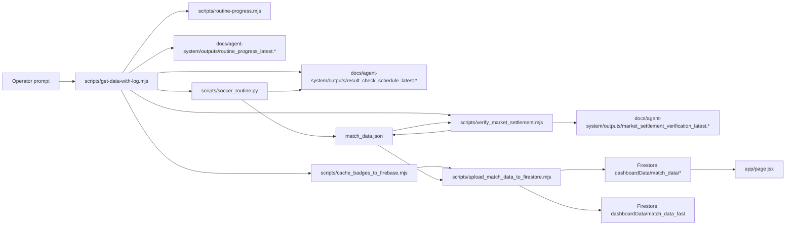

# Agent Function Dependency Map

Purpose: give coding agents a fast first-pass map from a Soccer Stats change request to the scripts, docs, data files, and Firestore paths that move together.

This is a dependency index, not a full static call graph. Read this first, then follow [AGENTS.md](C:/Betting/Soccer%20Stats/AGENTS.md), active task instructions, and the user’s scope.

## How To Use This Map

1. Search this file first for the workflow, script, artifact, or Firestore path mentioned in the prompt.
2. Open the matching node and inspect:
   - `Primary files`
   - `Depends on`
   - `Called by / affects`
   - `Firestore paths`
   - `Verification / evidence`
3. If no node exists, find the entry point, then add a node before or after the change.
4. Keep edits minimal. A narrow routine fix should not turn into a pipeline refactor.

Useful searches:

```powershell
rg -n "get:data|results-only|top-up|upload_firestore|verify_market_settlement|routine_progress|result_check_schedule" scripts docs
rg -n "dashboardData/match_data|match_data_fast|manualResultImports" scripts app
rg -n "precomputeDisplayData|display_markets|prediction_locked|cards_total|corners_total" scripts
```

## Map Rules

- Prefer workflow nodes over listing every helper.
- Record exact Firestore paths when a node reads or writes customer-facing data.
- Keep provider IDs separate. Sportsbet IDs are not SofaScore IDs.
- `match_data.json` is a generated artifact, not the dashboard source of truth.
- The dashboard reads Firestore only.

## Visual Overview



## Global Nodes

### Node: Next.js dashboard Firestore read path

Change aliases: dashboard card, live customer view, upcoming badge, match card, frontend data source.

Primary files:
- `app/page.jsx`
- `app/auth-gate.jsx`
- `app/layout.jsx`

Depends on:
- Firestore docs under `dashboardData/match_data/leagues/*`
- Fast doc / date docs published by the uploader

Called by / affects:
- Customer-facing dashboard
- Any “why is this still upcoming?” investigation

Firestore paths:
- `dashboardData/match_data`
- `dashboardData/match_data/leagues/*`
- `dashboardData/match_data/dates/*`
- `dashboardData/match_data_fast`

Verification / evidence:
- Firestore state is authoritative for customer freshness.
- Do not use local `match_data.json` as proof the dashboard updated.

### Node: Wrapper planner and execution controller

Change aliases: `get:data`, `get:data:results`, `get:data:topup`, results-only planner, upload retry, no-op decision.

Primary files:
- `scripts/get-data-with-log.mjs`
- `package.json`

Depends on:
- `scripts/routine-progress.mjs`
- `scripts/soccer_routine.py`
- `scripts/verify_market_settlement.mjs`
- `scripts/cache_badges_to_firebase.mjs`
- `scripts/upload_match_data_to_firestore.mjs`
- `docs/agent-system/outputs/routine_progress_latest.*`
- `docs/agent-system/outputs/result_check_schedule_latest.*`

Called by / affects:
- `npm.cmd run get:data`
- `npm.cmd run get:data:results`
- `npm.cmd run get:data:topup`
- `npm.cmd run get:data:sportsbet`
- `npm.cmd run get:data:bet365`
- Wrapper markdown/json logs under `docs/agent-system/outputs/get_data_*`

Firestore paths:
- None directly; delegates upload to the uploader node.

Verification / evidence:
- Decision must be progress first, then compiled queue, then schedule.
- Results-only must stay on settlement/upload work and not drift into top-up unless explicitly planned.

### Node: Routine progress ledger

Change aliases: `routine_progress_latest`, current stage, overdue pending, latest collected date, +6 coverage.

Primary files:
- `scripts/routine-progress.mjs`
- `docs/agent-system/outputs/routine_progress_latest.md`
- `docs/agent-system/outputs/routine_progress_latest.json`

Depends on:
- `match_data.json`
- `docs/agent-system/outputs/result_check_schedule_latest.json`
- Wrapper run metadata from `scripts/get-data-with-log.mjs`

Called by / affects:
- Wrapper branching
- Agent review gates
- Automation/operator reporting

Firestore paths:
- None directly, but progress claims about forecast coverage must be verified against Firestore before being treated as complete.

Verification / evidence:
- Must include stage, pending/resulted counts, overdue pending, latest collected date, required latest date, and agent review gate fields.

## Routine Workflow Nodes

### Node: Python routine orchestration

Change aliases: full routine, results-only settlement, seed next day, top-up horizon, SofaScore result fetch, Sportsbet fallback evidence.

Primary files:
- `scripts/soccer_routine.py`

Depends on:
- SofaScore event ownership for tracked fixtures/results
- Local helpers invoked by `run_helper(...)`
- `match_data.json`
- `docs/agent-system/outputs/result_check_schedule_latest.*`

Called by / affects:
- Wrapper planner
- Results-only settlement path
- Full forecast refresh path
- Targeted top-up path

Firestore paths:
- None directly; writes local artifacts consumed by settlement/upload.

Verification / evidence:
- Results-only is due-ID scoped.
- `kickoff/start + 3 hours` is the canonical result-check time.
- Non-SofaScore fixture IDs must not enter the due-result fetch path.

### Node: Result check schedule

Change aliases: `result_check_schedule_latest`, due rows, `DUE @`, next due time, Adelaide queue.

Primary files:
- `scripts/soccer_routine.py`
- `docs/agent-system/outputs/result_check_schedule_latest.md`
- `docs/agent-system/outputs/result_check_schedule_latest.json`

Depends on:
- Tracked matches in `match_data.json`
- Adelaide-local kickoff parsing and due-time derivation

Called by / affects:
- Wrapper planner
- Operator due-result decisions
- Carry-forward reporting

Firestore paths:
- None directly.

Verification / evidence:
- Recompute due from live Adelaide time and derived `kickoff + 3 hours`.
- Use this alongside the compiled day queue; do not trust stale provider statuses alone.

### Node: Market settlement gate

Change aliases: `verify_market_settlement`, unresolved FT markets, missing cards/corners actuals, pre-upload block.

Primary files:
- `scripts/verify_market_settlement.mjs`
- `docs/agent-system/outputs/market_settlement_verification_latest.md`
- `docs/agent-system/outputs/market_settlement_verification_latest.json`

Depends on:
- `match_data.json`
- `scripts/precompute_display_markets.mjs`
- Stored `actuals.cards_total`
- Stored `actuals.corners_total`

Called by / affects:
- Wrapper pre-upload gate
- Upload readiness
- Agent intervention reporting

Firestore paths:
- None directly; blocks or allows the upload path.

Verification / evidence:
- Score-derived markets can be repaired locally from FT scores.
- Stat-derived markets require actual totals or manual import; do not invent them.

### Node: Badge caching

Change aliases: team crest, logo cache, Firebase Storage badge, initials fallback.

Primary files:
- `scripts/cache_badges_to_firebase.mjs`

Depends on:
- Provider badge URLs as input only
- Firebase Storage target bucket
- Existing match/team badge fields

Called by / affects:
- Full refresh
- Results-only publish path
- Sportsbet/bet365 source refresh paths

Firestore paths:
- Badge fields later published into `dashboardData/match_data/*`

Verification / evidence:
- Final dashboard badges must be Firebase-owned URLs or initials fallback.
- Never synthesize badge URLs from mixed provider IDs.

### Node: Firestore uploader and verification

Change aliases: publish to Firestore, upload retry, league docs, date docs, fast doc, customer freshness.

Primary files:
- `scripts/upload_match_data_to_firestore.mjs`

Depends on:
- `match_data.json`
- `scripts/precompute_display_markets.mjs`
- Manual result imports from Firestore
- Firebase admin credentials

Called by / affects:
- Wrapper upload stages
- Recovery path when wrapper upload hangs or times out
- Dashboard customer state

Firestore paths:
- `dashboardData/match_data`
- `dashboardData/match_data/leagues/*`
- `dashboardData/match_data/dates/*`
- `dashboardData/match_data/chunks/*`
- `dashboardData/match_data/manualResultImports/*`
- `dashboardData/match_data_fast`

Verification / evidence:
- Upload uses small REST-backed batches with retry.
- Post-upload verification must confirm FT rows and settled visible markets are present in Firestore, not just locally.
- Missing credentials means one of:
  - `.secrets/firebase-service-account.json`
  - `GOOGLE_APPLICATION_CREDENTIALS`
  - `FIREBASE_SERVICE_ACCOUNT_JSON`

## Data / Artifact Nodes

### Node: Local generated store

Change aliases: `match_data.json`, local slate, generated upload artifact, prediction lock state.

Primary files:
- `match_data.json`
- `scripts/soccer_routine.py`
- `scripts/verify_market_settlement.mjs`
- `scripts/upload_match_data_to_firestore.mjs`

Depends on:
- Routine collection/settlement logic
- Manual result imports
- Precomputed display market generation

Called by / affects:
- Progress ledger
- Schedule generation
- Settlement gate
- Firestore upload

Firestore paths:
- None directly; this file feeds the upload path.

Verification / evidence:
- Useful for local pipeline state only.
- Never treat it as customer-visible truth without Firestore verification.

### Node: Manual result imports

Change aliases: manual result import, blocked FT settlement recovery, cards/corners backfill, terminal void import.

Primary files:
- `scripts/upload_match_data_to_firestore.mjs`
- `scripts/apply_manual_result_imports.mjs`

Depends on:
- Firestore collection containing manual imports
- Match matching by ID/date/team names

Called by / affects:
- Results-only recovery path
- FT stat backfill when provider actuals are missing in the normal lane

Firestore paths:
- `dashboardData/match_data/manualResultImports/*`

Verification / evidence:
- Can lock FT rows or void terminal postponed/cancelled rows.
- Still requires publish to Firestore to reach customers.

## Add A New Node

```md
### Node: <workflow or function name>

Change aliases: <search terms>

Primary files:
- `<path>`

Depends on:
- `<imports, artifacts, scripts, providers>`

Called by / affects:
- `<routes, wrapper stages, customer surfaces>`

Firestore paths:
- `<exact paths or None directly>`

Verification / evidence:
- `<what proves the change actually worked>`
```

## Current Coverage Gaps

- Frontend component-level map under `app/page.jsx` is intentionally not expanded yet.
- Stripe/app hosting paths are not expanded here.
- Helper scripts under the Python routine are grouped at workflow level rather than mapped one by one.
